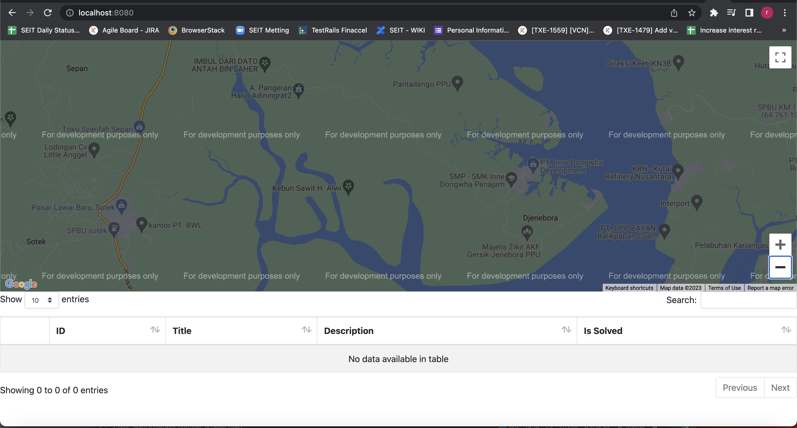

# Running Application
 > For running application just run Application in folder ```src\main\java\eight\java\spring\data\Application``` or using command ```mvn spring-boot:run``` 
# Access dashboard page
 > For access the main dashbord just locate your browser into ```http://localhost:8080/```
# Tech stack
 - Springboot
 - Mysql
 - RabbitMQ/SpringAMQP/Firebase
# Screenshoots
 - dashboard page

